# Comic Chat: Server-Side Generative AI Architecture

This repository outlines the data flow, protocols, and synchronization mechanics for the **Generative AI** version of the multiplayer "Comic Chat" room system. 

Instead of compositing pre-drawn 2D vector sprites, this design leverages server-side Generative AI models (Google Vertex AI) to synthesize unique, photorealistic, or stylized comic book panels on-demand from conversational text.

---

## 🗺️ System Concept & Data Flow

The architecture operates as a **Thin Client Pattern**. The client browser handles simple message dispatching and UI rendering, while the server coordinates the multi-model AI pipeline:

1. **User Ingestion**: A user types a conversational chat message. The browser transmits this raw message directly to the server over WebSockets.
2. **Dialogue & Visual Scripting (Vertex AI: Gemini)**: The server queries a Large Language Model (Gemini Pro) to structure the scene:
   - Evaluates conversation context.
   - Formulates the character's verbal dialogue.
   - Generates a detailed descriptive prompt for image generation (specifying pop-art comic layouts, lighting, and expressions).
3. **Image Synthesis (Vertex AI: Imagen)**: The server passes the descriptive prompt to an Image Generation model (Imagen) to render the full panel graphics.
4. **Dialogue Bubble Overlay (Pillow)**: The server overlays the speech bubble and text onto the synthesized graphic canvas.
5. **Real-time Sync**: The compiled JPEG is saved on the server's static directory and the URL is broadcasted to all connected peers in that room.

```mermaid
sequenceDiagram
    autonumber
    actor Client A as User A (Chrome)
    participant Server as FastAPI Server (main.py)
    participant Gemini as Vertex AI: Gemini
    participant Imagen as Vertex AI: Imagen
    actor Client B as User B (Chrome)

    Note over Client A, Client B: Connected to WebSockets Room
    Client A->>Server: WS Send: type="chat_message" {sender: "Alice", text: "Look out!"}
    
    rect rgb(30, 41, 59)
        Note over Server: Server acts as central coordinator
        Server->>Gemini: Prompt: Write dialogue and compile visual scene details
        Gemini-->>Server: Returns: {dialogue: "...", visual_prompt: "..."}
        
        Server->>Imagen: Generate Image from visual_prompt
        Imagen-->>Server: Returns: raw synthesized JPEG bytes
        
        Note over Server: Overlays speech bubble & text onto JPEG
        Server->>Server: Saves: /static/generated/gen_panel_xyz.jpg
    end
    
    Server->>Client A: WS Broadcast: type="new_panel" (image_url & dialogue)
    Server->>Client B: WS Broadcast: type="new_panel" (image_url & dialogue)
    Note over Client A, Client B: Both screens synchronize and display the generated panel
```



---

## 🔌 WebSocket Synchronization Protocol

Real-time synchronization between the room clients and the server uses two message payloads.

### 1. Client-to-Server Event (`chat_message`)
Dispatched by the sender browser client. Since the LLM execution is centralized on the server, the client only transmits the raw message text.

```json
{
  "type": "chat_message",
  "sender": "Alice",
  "text": "Help! The monster is right behind you!"
}
```

### 2. Server-to-Client Event (`new_panel`)
Broadcasted by the server to all active WebSockets connected to the room.

```json
{
  "type": "new_panel",
  "sender": "Alice",
  "dialogue": "Look out!",
  "image_url": "/static/generated/gen_panel_room-123_1721289190.jpg"
}
```

---

## 🎨 Server-Side Image Post-Processing

Once the server synthesizes the raw image from the Vertex AI Imagen endpoint, the layout engine executes post-processing steps before distribution:
- **Speech Bubble Compositing**: Analyzes text length to adjust the bubble container width and draws the pointing vector tail towards the speaker's side.
- **Panel Framing**: Adds the bold comic frame border and overlays a top-left title tag detailing the active character state.
- **Serving**: Writes the completed layout to local disk storage and serves it statically.
