# Comic Chat: Multiplayer Room Architecture & Data Flow

This repository details the architectural layout, data protocols, and synchronization mechanics for the multiplayer "Comic Chat" room system. 

---

## 🗺️ System Concept & Flow

The system splits workloads to minimize server-side computational load and ensure zero text-history exposure on the server:
1. **Client-Side LLM Execution**: The user's input text is processed locally in their Chrome browser using the experimental `window.ai` Prompt API (Gemini Nano).
2. **Structured Payload Transfer**: The browser formats the LLM output into structured JSON and dispatches it over WebSockets.
3. **Server-Side Pillow Composition**: The FastAPI server receives the JSON, resolves the appropriate graphic layers, draws the panel, writes it locally to the static folder, and broadcasts the panel URL to all connected peers in that room.

```mermaid
sequenceDiagram
    autonumber
    actor Client A as User A (Chrome)
    participant Server as FastAPI Server (main.py)
    actor Client B as User B (Chrome)

    Note over Client A, Client B: Connected to WebSocket: /ws/room/comic-room-123
    Client A->>Client A: Input text: "I'm so excited to build this!"
    rect rgb(30, 41, 59)
        Note over Client A: local window.ai (Gemini Nano) processes input
        Note over Client A: Formulates structured JSON:<br/>{character: "hero", emotion: "happy", dialogue: "..."}
    end
    Client A->>Server: WS message: type="chat_message"
    rect rgb(30, 41, 59)
        Note over Server: pillow_renderer.py draws comic bubble & character
        Note over Server: Saves image: app/static/generated/room_xyz.jpg
    end
    Server->>Client A: WS broadcast: type="new_panel" (image_url & dialogue)
    Server->>Client B: WS broadcast: type="new_panel" (image_url & dialogue)
    Note over Client A, Client B: HTML feed updates and renders the comic panel image
```



---

## 🔌 WebSocket Synchronization Protocol

The real-time synchronization between the room clients and the server uses two message payloads.

### 1. Client-to-Server Event (`chat_message`)
Dispatched by the sender client after client-side LLM processing has successfully completed.

```json
{
  "type": "chat_message",
  "sender": "Alice",
  "text": "Wow, this local LLM is incredible!",
  "character_name": "hero",
  "detected_emotion": "happy"
}
```

### 2. Server-to-Client Event (`new_panel`)
Broadcasted by the server to all active WebSockets connected to the room.

```json
{
  "type": "new_panel",
  "sender": "Alice",
  "dialogue": "Wow, this local LLM is incredible!",
  "character": "hero",
  "emotion": "happy",
  "image_url": "/static/generated/room_comic-room-123_1721289190.jpg"
}
```

---

## 🧠 Client-Side LLM Integration (`window.ai`)

The browser accesses Chrome's Gemini Nano using the Prompt API.

### System Instructions & Prompt Construction
The prompt is configured to instruct the local assistant to reply strictly in a raw JSON string to facilitate client parsing:
- **character_name**: speaker character (hero, sidekick, or villain)
- **detected_emotion**: detected emotion (happy, sad, angry, thinking, surprised, or neutral)
- **formatted_dialogue**: a punchy, short dialogue text appropriate for a small comic bubble. Keep it under 15 words.

---

## 🎨 Server-Side Image Composition

When a `chat_message` JSON payload is received, the server uses Pillow to construct the image:

1. **Background Layer**:
   - Width: 800px, Height: 800px.
   - Generates a styled retro gradient (Cyan to Magenta) with halftone-style backing circles.
2. **Character Layer**:
   - Resolves directory path matching character_name and checks for emotion-matching files.
   - Dynamically resizes to fit within a 450px bounding box and composites with alpha transparency onto the bottom-right corner.
3. **Speech Bubble Layout**:
   - Calculates bounds for the bubble rectangle.
   - Fits dialogue text using standard font bounding-box text wrapping.
   - Draws a rounded rectangle (radius=20) and composites a polygon tail pointing toward the character's coordinate frame.
