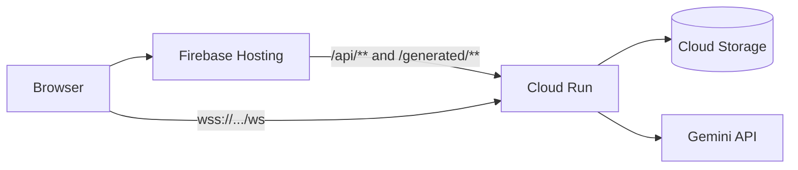

# Comic Chat Multiplayer

Comic Chat is a realtime multiplayer comic panel generator with:

- **Frontend** on Firebase Hosting
- **Backend** on Cloud Run
- **Generated panels** persisted in GCS
- **CI/CD** through GitHub Actions

## Architecture



## Runtime routing

1. Firebase serves static frontend (`/`, `/room/*`).
2. Firebase rewrites API and generated-image paths to Cloud Run.
3. WebSocket connects directly to Cloud Run from the browser.

## Required environment variables

Set these in CI/CD (GitHub Actions variables/secrets), not in source files:

- `PROJECT_ID`
- `REGION`
- `SERVICE`
- `IMAGE_REPO`
- `BUCKET_NAME`
- `DEPLOY_SERVICE_ACCOUNT`
- `GCP_WORKLOAD_IDENTITY_PROVIDER`
- `GEMINI_API_KEY`

## GitHub setup process

1. Configure Workload Identity Federation in GCP for GitHub OIDC.
2. Add GitHub repository secret:
   - `GCP_WORKLOAD_IDENTITY_PROVIDER` (full provider resource path)
3. Add GitHub repository secret:
   - `GEMINI_API_KEY`
4. Add repository variables or workflow env values for non-secret settings:
   - project, region, service, repo, bucket, service account.

## IAM setup process

1. Create a deploy service account.
2. Grant GitHub OIDC principal the following on that service account:
   - `roles/iam.workloadIdentityUser`
   - `roles/iam.serviceAccountTokenCreator`
3. Grant deploy service account required project roles:
   - `roles/run.admin`
   - `roles/artifactregistry.admin`
   - `roles/storage.admin`
   - `roles/iam.serviceAccountUser`
4. Grant runtime identity bucket write access:
   - `roles/storage.objectUser` on the generated-panels bucket.

## Backend deployment process (Cloud Run)

Workflow: `.github/workflows/deploy-cloud-run.yml`

It should:

1. Authenticate to GCP via OIDC.
2. Build and push container image to Artifact Registry.
3. Ensure storage bucket exists.
4. Deploy Cloud Run with:
   - Gen2 execution environment
   - WebSocket-friendly timeout
   - Single-instance limit (if keeping in-memory room state)
   - GCS volume mounted at `/app/static/generated`

## Frontend deployment process (Firebase Hosting)

Config: `firebase.json`

Expected rewrite behavior:

- `/api/**` -> Cloud Run
- `/generated/**` -> Cloud Run
- `**` -> `/index.html`

Deploy:

```bash
npx -y firebase-tools deploy --only hosting --project <PROJECT_ID>
```

## Local development

```bash
go run .
```

Required local env:

- `GEMINI_API_KEY`

Optional browser override for backend origin:

```js
localStorage.setItem("comicChatBackendOrigin", "https://<your-cloud-run-url>");
```

## Troubleshooting

- **WebSocket 502 via Firebase `/ws`**: use direct Cloud Run WebSocket origin from frontend.
- **WIF audience errors**: provider value must be full `projects/.../providers/...` path.
- **`iam.serviceAccounts.getAccessToken` denied**: add `roles/iam.serviceAccountTokenCreator` to OIDC principal on deploy SA.
- **Artifact Registry permission denied**: add `roles/artifactregistry.admin` on deploy SA.

## Cloud Run frontend serving

You can keep static serving enabled in Cloud Run as a fallback, but primary frontend should be Firebase Hosting.  
If you want strict separation later, remove static-file serving from Cloud Run and keep only API/WebSocket/generated-assets there.
